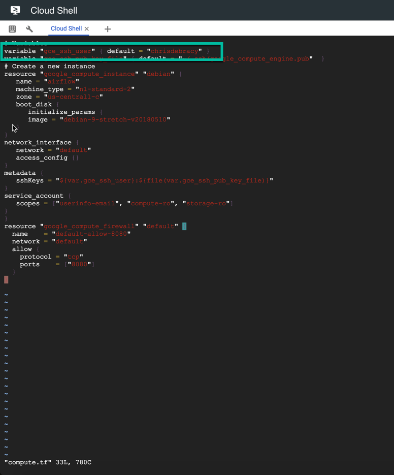
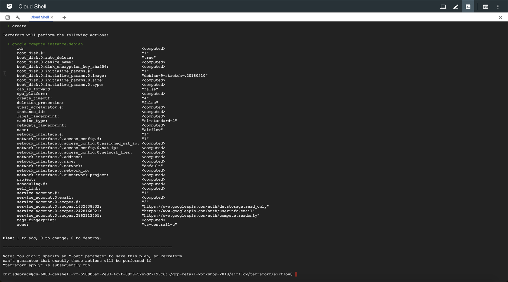
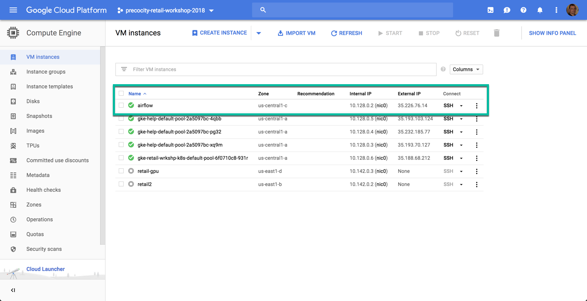

# Airflow Hands-On Lab
## Overview
This lab is designed to demonstrate how to use Terraform to create a compute instance and then configure an Airflow instance using Ansible.

Precocity uses Terraform for overall infrastrucutre deployment and Ansible for the installation and configuration management of resources.

## Hands-On
### Pre-Requisites
* Cloud Shell
* `git clone https://github.com/precocity/gcp-retail-workshop-2018.git`

>Note: Unless otherwise explicitly stated, all the commands below are to be executed in Cloud Shell as-is. If you have already run the `git clone` command, it is not necessary to do it again.

>Note: Once you are done with all the exercises, please go through the last Cleanup exercise to review and make sure any running resources are terminated.

---
### Exercise 1: Creating the Airflow Instance with Terraform

Expected Time: 5 mins

In this section you will configure Terraform and create a service account key for use with Ansible.

**Step 1:**
Downloading Terraform

From Google Cloud Shell run the following commands:

* `gcloud config set project [PROJECT_ID]`

Replace [PROJECT_ID] with your project name. From this point on we can reference your project name using the $DEVSHELL_PROJECT_ID environment variable.

* `cd gcp-retail-workshop-2018/airflow/terraform/airflow`

This is the folder from which you will install and configure Terraform. Run the following commands in order:

* `wget https://releases.hashicorp.com/terraform/0.11.7/terraform_0.11.7_linux_amd64.zip`
* `unzip terraform_0.11.7_linux_amd64.zip -d .`
* `./terraform -v`

The output from the last command should display `Terraform v0.11.7`.

**Step 2:**
Creating a Service Account

You will create a service account with editor permissions that both Terraform and Ansible can use to create and configure GCP resources needed for Airflow. Enter the following:

`$ gcloud iam service-accounts create airflow`

If prompted to enable the API, press Y to continue. The output from the command should display:

`Created service account [airflow].`

These next two commands will create the credentials needed to communicate with the Airflow instance and add the appropriate role to the service account:

'gcloud iam service-accounts keys create ~/gce-airflow-key.json --iam-account=airflow@$DEVSHELL_PROJECT_ID.iam.gserviceaccount.com'

THe output should look similar to below:

`created key [230bc3e5da71391ffd8554a7f1a2a661d51a9045] of type [json] as [/home/chrisdebracy/gce-airflow-key.json] for [airflow@precocity-retail-workshop-2018.iam.gserviceaccount.c
om]`

Now enter:
`gcloud projects add-iam-policy-binding $DEVSHELL_PROJECT_ID  --member serviceAccount:airflow@$DEVSHELL_PROJECT_ID.iam.gserviceaccount.com --role roles/editor`

The output displayed will be a list of members and their roles for the project.

**Step 3:**
Configuring the Terraform Files

You will next edit the `provider.tf` file to include your project name:

`vi provider.tf`

Move the cursor to the project name and press `I` to put the editor into insert mode. Use the `DEL` key to delete the sample project name and enter your own. When complete, press `ESC` and `:wq` to save and quit the editor.

Now, edit the `compute.tf` file. This time you will edit the default user to your account name.

Move the cursor to the user name and press `I` to put the editor into insert mode. Use the `DEL` key to delete the sample user name and enter your own. When complete, press `ESC` and `:wq` to save and quit the editor.

**Step 4:**
Running Terraform

The next commands will initialize Terraform, create the deployment plan and then apply that plan to create your Airflow instance.

If you're not in the `gcp-retail-workshop-2018/airflow/terraform/airflow` folder, change to it now:

`cd ~/gcp-retail-workshop-2018/airflow/terraform/airflow`

Run the init command:

'./terraform init'

Your cloud shell should look similar to the screen below:

Now, run the next command to create the deployment plan:

`./terraform plan`

Your shell should look similar to the following:

It is time to deploy your Airflow instance. Please enter the following:

`./terraform apply`

When prompted to continue, enter `yes` and press Enter.

From the Google Cloud Console, navigate to the Compute Engine | VM Instances page and you will see an `airflow` instance created.

**Step 5:**
Verify SSH Access

Part of the Terraform deployment for Airflow is to copy the local SSH key for your account to the Airflow instance.

