# Airflow Hands-On Lab
## Overview
In the previous BigQuery labs you ran an number of DataFlow jobs manually. In a production environment you would want to automate these jobs on a schedule. Airflow is the tool of choice for automating ETL jobs, due to its rich set of built-in operators, create sophisticated orchestration for the movement of data and an ability to create custom operators to extend its functionality.

This lab is designed to demonstrate how to use Terraform to create a compute instance and then configure an Airflow instance using Ansible.

Precocity uses Terraform for overall infrastructure deployment and Ansible for the installation and configuration management of resources.


## Hands-On
### Pre-Requisites
* Cloud Shell
* `gcloud config set project [PROJECT_ID]`
* `gcloud config set compute/zone us-central1-c`
* `git clone https://github.com/precocity/gcp-retail-workshop-2018.git`
* `cd ~/gcp-retail-workshop-2018/scripts`
* `./02_variableSubstitution.sh`

>The first command isn't necessary unless your GOOGLE_CLOUD_PROJECT environment variable doesn't match your project name. If you do need it, substitute your project id for the [PROJECT_ID] placeholder. The third command should already have been run as part of the BigQuery lab exercises.

>Note: Unless otherwise explicitly stated, all the commands below are to be executed in Cloud Shell as-is. If you have already run the `git clone` command, it is not necessary to do it again.

---
### Lab 1: Creating the Airflow Instance with Terraform

Expected Time: 10 mins

In this section you will configure Terraform and create a service account key for use with Ansible.

**Step 1:**
Configuring SSH and Downloading Terraform

First, run the following command:

`gcloud compute config-ssh`

The following content will appear:

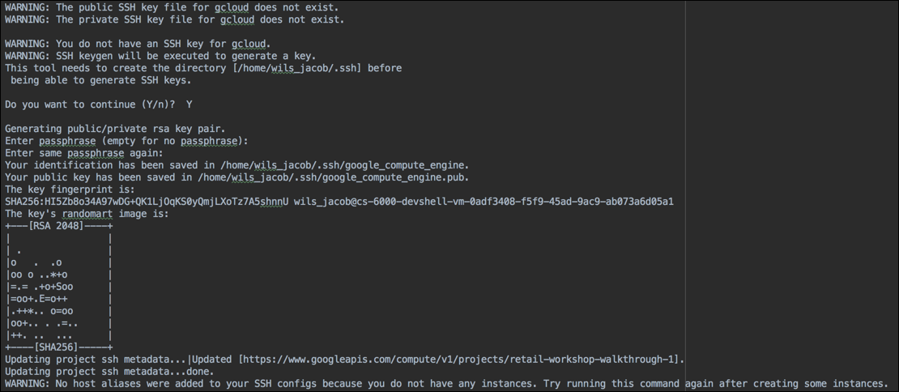

The SSH key created here will be used by Terraform when deploying the Airflow instance. Now you can navigate to the Terraform folder.

* `cd gcp-retail-workshop-2018/airflow/terraform/airflow`

This is the folder from which you will install and configure Terraform. Run the following commands in order:

* `wget https://releases.hashicorp.com/terraform/0.11.7/terraform_0.11.7_linux_amd64.zip`
* `unzip terraform_0.11.7_linux_amd64.zip -d .`
* `./terraform -v`

The output from the last command should display something similar to below:

>
>`Terraform v0.11.7`.
>

You have successfully installed Terraform.

**Step 2:**
Creating a Service Account

In this lab You will create a service account with editor permissions that Terraform and Ansible will use to create and configure GCP resources needed for Airflow. Enter the following:

`gcloud iam service-accounts create airflow`

If prompted to enable the API, press Y to continue. The output from the command should display:

>
>Created service account [airflow].
>

These next two commands will create the credentials needed to communicate with the Airflow instance and add the appropriate role to the service account that you just created.

`gcloud iam service-accounts keys create ~/gce-airflow-key.json --iam-account=airflow@$GOOGLE_CLOUD_PROJECT.iam.gserviceaccount.com`

The output should look similar to below:

>created key [230bc3e5da71391ffd8554a7f1a2a661d51a9045] of type [json] as [/home/chrisdebracy/gce-airflow-key.json] for [airflow@precocity-retail-workshop-2018.iam.gserviceaccount.c
om]

Now enter:

`gcloud projects add-iam-policy-binding $GOOGLE_CLOUD_PROJECT  --member serviceAccount:airflow@$GOOGLE_CLOUD_PROJECT.iam.gserviceaccount.com --role roles/editor`

>The output displayed will be a list of members and their roles for the project.

This next command will add the new service account you just created to the precocity-retail-workshop-2018 project, so we can programmatically access the public bucket to retrieve the staging files.

`gcloud projects add-iam-policy-binding precocity-retail-workshop-2018  --member serviceAccount:airflow@$GOOGLE_CLOUD_PROJECT.iam.gserviceaccount.com --role roles/storage.admin`

**Step 3:**
Running Terraform

The next commands will initialize Terraform, create the deployment plan and then apply that plan to create your Airflow instance.

If you're not in the `gcp-retail-workshop-2018/airflow/terraform/airflow` folder, change to it now:

`cd ~/gcp-retail-workshop-2018/airflow/terraform/airflow`

Run the init command:

`./terraform init`

Your cloud shell should look similar to the screen below:

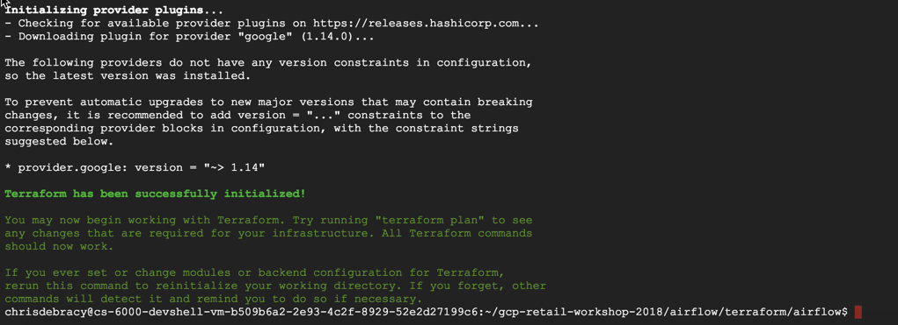

Now, run the next command to create the deployment plan:

`./terraform plan`

Your shell should look similar to the following:


Now you can deploy your Airflow instance. Please enter the following:

`./terraform apply`

When prompted to continue, enter `yes` and press Enter.

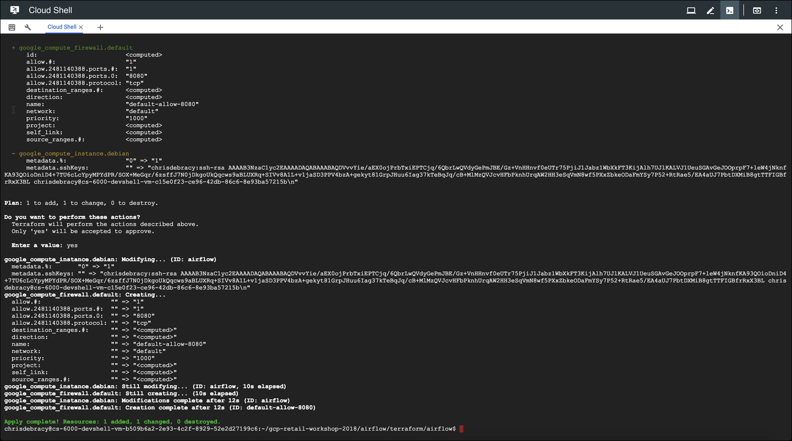

From the Google Cloud Console, navigate to the Compute Engine | VM Instances page and you will see an `airflow` instance created.


**Step 5:**
Verify SSH Access

Part of the Terraform deployment for Airflow copies your local SSH key for your account to the Airflow instance. This last set of commands will configure and verify the ssh access.

`gcloud compute config-ssh`

The output should look similar to the that below:

>You should now be able to use ssh/scp with your instances.
>For example, try running:
>  $ ssh retail2.us-east1-b.precocity-retail-workshop-2018

Enter the following, substituting your name and project id as needed. This is required to initialize the ssh connectivity to the airflow instance for Ansible.

`ssh $USER@airflow.us-central1-c.$GOOGLE_CLOUD_PROJECT`

The next prompt will appear:

>The authenticity of host 'compute.937945848083147541 (35.226.76.14)' can't be established.
>ECDSA key fingerprint is SHA256:1CMAxEisZL17ammaMOqMt4rIRIuGzHSX1SpFypbwVyE.
>Are you sure you want to continue connecting (yes/no)?

Enter `yes` to continue. The following will appear, along with the airflow prompt to indicate you are connected:

>Warning: Permanently added 'compute.937945848083147541' (ECDSA) to the list of known hosts.
>Linux airflow 4.9.0-6-amd64 #1 SMP Debian 4.9.88-1+deb9u1 (2018-05-07) x86_64
>The programs included with the Debian GNU/Linux system are free software;
>the exact distribution terms for each program are described in the
>individual files in /usr/share/doc/*/copyright.
>Debian GNU/Linux comes with ABSOLUTELY NO WARRANTY, to the extent
>permitted by applicable law.

To quit the airflow instance, type:

`exit`

---
### Lab 2: Installing Airflow with Ansible

Expected Time: 10 mins

In this section you will configure and run Ansible to deploy the Airflow application and artifacts onto the new airflow instance you created with Terraform.

**Step 1:**
Installing Ansible

The following commands will change to the Ansible folder from where you will perform the install of Ansible and the running of the playbook. A script that installs pip packages needs execute permissions set and then you will run the script to install Ansible.

```
cd ~/gcp-retail-workshop-2018/airflow/ansible/airflow
. ./ansible_install.sh
```

> Ansible requires sudo access to install and the binaries will not survive the exiting of Google Cloud Shell.
> The last command `. ./ansible_install.sh` needs the extra space between the two periods as it is setting environment variables that you want exposed to your current session.

When successful, your cloud shell should look similar to the screen below:


**Step 2:**
Running Ansible's Playbook

First, verify you have connectivity to the airflow instance:

`ansible all -m ping`

The output should look similar to the following:

>airflow.us-central1-c.precocity-retail-workshop-2018 | SUCCESS => {
>    "changed": false,
>    "ping": "pong"
>}

If the text isn't green and "SUCCESS" not shown, check your previous steps. This command needs to work before proceeding. If all is well, you can run the Ansible command to install the Playbook:

`ansible-playbook provision.yml`

> Answer `yes` if prompted to authenticate the host.

The content that displays is extensive and spans more than one screen. You will see several warnings that you can ignore.

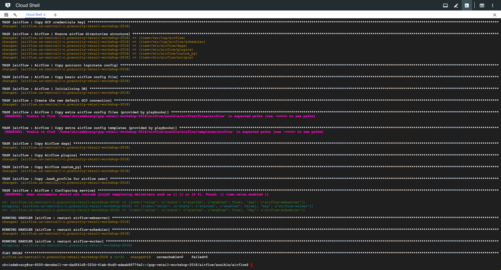

Navigate to the Compute Engine | VM Instances page from Google Cloud Console and you will see the external IP of your airflow instance.


Copy the IP followed by `:8080` into a browser window and press Enter. The Airflow GUI will appear.

Congratulations! You have installed and configured an Airflow instance on GCP using Terraform and Ansible. The next lab will walk you through a little of how Airflow works.

___
### Lab 3: Using Airflow

Expected Time: 20 mins

As mentioned earlier, Airflow allows you to automate jobs to run on a schedule, or an event. The DAGS presented here are very basic and don't show the complexity possible for creating pipeline branches, configuring dependencies, etc. Suffice it to say that Airflow has become so popular Google Cloud Platform now offers it in beta as Cloud Composer.

In this final lab you will run jobs that automate tasks that you manually ran in the BigQuery labs. For production deployments, running such tasks on a regular schedule is a must.

**Step 1:**
Introduction to the Airflow GUI


The landing page you see will be http://IP:8080/admin. You'll see that two DAGS have been deployed:

* bq_stores_sales_processing
* channel_processing

By default Airflow pauses new DAGs that have been deployed so they don't start running prematurely. In the screen above you'll see 2 columns highlighted. The first column is a toggle that pauses/un-pauses a DAG's execution. To the right is the name of the DAG. The column after that contains the schedule for the DAG. The schedule format follows that of a Linux crontab very closely. The `bq_stores_sales_processing` DAG runs every 10 minutes and the `channel_processing` DAG runs every 30 minutes.

Schedules for DAGS can use shortcuts such as @hourly, @daily, @weekly, etc.

The Owner column shows the name of the user the DAG will run under. In most environments this will be "airflow", but if you communicate into other networks your owner name may represent a user account they've given you.

The Recent Tasks, Last Run and DAG Runs columns provide status for each category. You can move your mouse over the `i` next to each column name for more information.

The Links column lets you kick off DAGs immediately, short-cutting whatever schedule they are on. Additional icons let you view the DAG in different ways, view the execution times, the code for the DAG, etc. Again, you can mouseover any of the icons for more information.

>Note that the current time is shown in the upper right-hand corner of your browser page. Airflow defaults to UTC time and prefers to run everything against UTC time. Logs can appear in your local time-zone, but for scheduling purposes, keep in mind that all scheduled times need to be adjusted for your local time zone.


**Step 2:**
Running the channel_processing DAG

Let's start with the channel_processing DAG. Click the `Off` button to toggle it `On`. In 10 seconds or so, click the refresh icon for the DAG on the far right of the Links column.

Airflow runs tasks for the previous scheduled interval. When you first un-pause the DAG, Airflow will notice that the DAG hasn't been run before and it will kick off fairly quickly to complete the run for the previous scheduled time.

You will see this with the light green `1` that appears in the DAG Runs column. Periodically hit the refresh button for your DAG until you see it.

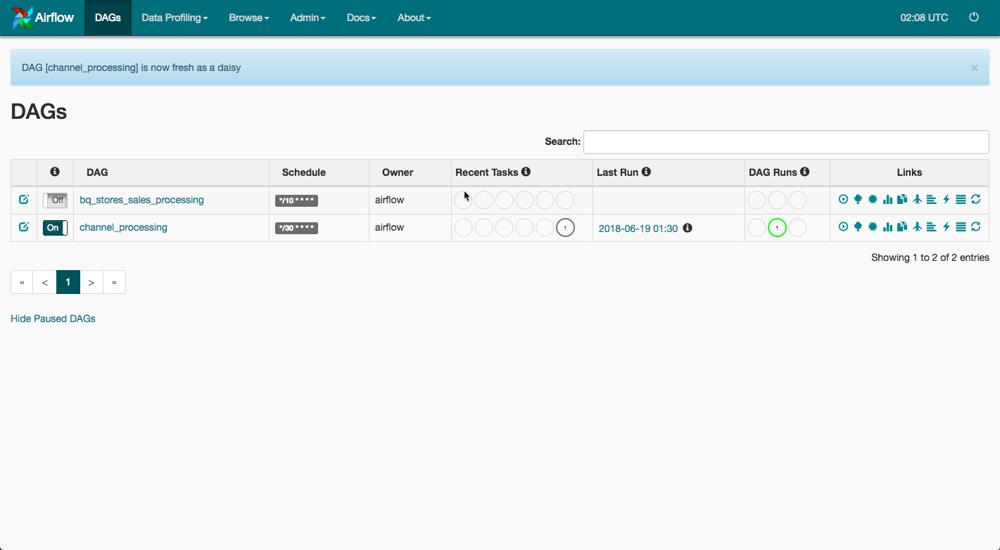

Depending on the speed of your instance and quickness with the refresh button, you may miss the light green icon and see it go immediately to dark green. Light green indicates running and dark green indicates success.

Since this DAG runs only every 30 minutes, let's look at the successful run.

Click the green `1` in the Recent Tasks column.

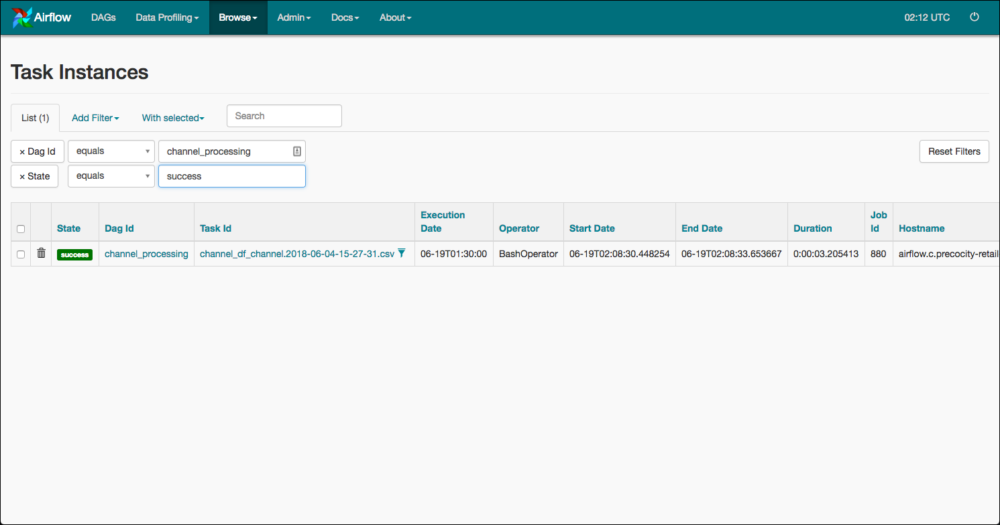

This screen shows the state of the instance, the task id, the execution date, operator, start date, etc. Note that the Execution Date is earlier than the Start Date. Remember, Airflow when the previously scheduled interval complets.

Click the Dag Id link next.

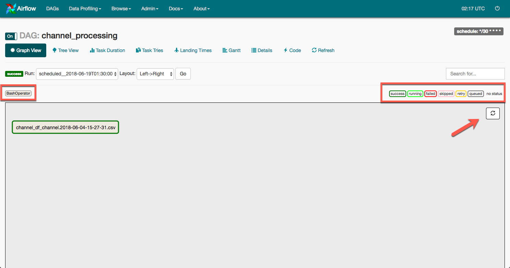

A few things to note about this page. Typically you would see a number of different tasks with lines drawn to represent dependencies. DAGs are a collection of tasks that can run in parallel, perform branching, etc. You may have a DAG that reads from multiple tables simultaneously in parallel but then merge together in a task that performs some data manipulation task before splitting off in a combination of sequential or parallel tasks.

The middle left corner that is highlighted shows the Airflow operator(s) involved. Because this is a simple DAG, just the BashOperator is used. In more complex jobs, you may have several operators performing tasks.

THe middle right portion highlighted shows the state of a particular task.

*queued: the task is ready to run, but waiting for free resources from Airflow to kick off.
*retry: the task failed. If a retry interval was configured it will attempt to retry that many times before reporting a failure.
*skipped: the task was skipped, likely due to a condition in the DAG that was not meant and the task should not be run.
*failed: the task failed after being unable to complete successfully after hitting the max retries.
*running: the task is actively running.
*success: the task finished successfully.

When a DAG is running through its tasks, you can click the refresh button to see the current status of the DAG instance.

Before moving onto the next step, let's take a quick look at a couple of options. The ones not covered you may explore on your own.

Click the task id that is highlighted in dark green. From the pop-up, click the View Log button.

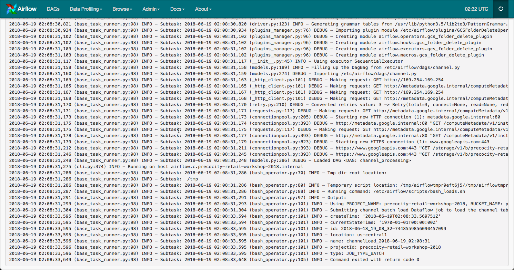

As discussed before, note that the timestamps for the log entries are in CST, not UTC time. Airflow logging uses the time-zone of the server for logging purposes.

You can scroll through the log to see what Airflow is doing to execute the job. Note that there are no errors in the log.

Next, click the `Code` link at the top of the page.

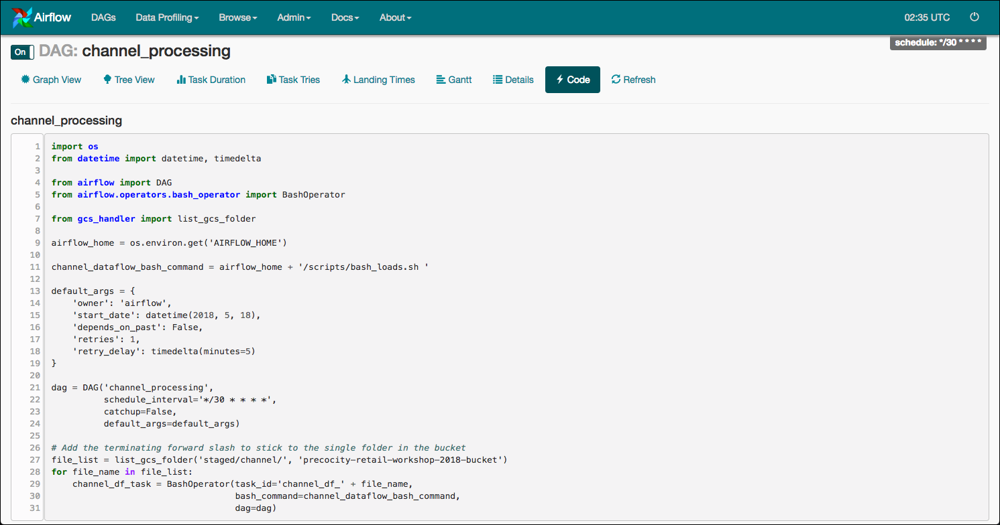

This lab won't try to explain all the various configuration of the DAG, but we will highlight a couple of things. First, Airflow is written in Python and DAG's are also Python code.

The first part of the page configures imports for the various modules used. The bash command is represented by a string and becomes a parameter for the BashOperator at the bottom of the page.

>Starting with line 27 you'll see code that retrieves a file list in the /staging/channel folder of the public `precocity-retail-workshop-2018-bucket`. If there were multiple files staged there, you would see a task id for each one. Airflow requires task id's to be unique in a DAG, so when it is necessary to create tasks dynmically, append some identifier to the end of the task id to ensure uniqueness.

The bottom task represented by the `channel_df_task` runs a bash script that kicks off a DataFlow job. Airflow actually has a DataFlow operator, but it requires a .jar file not used as part of these Google templates, so the script was created instead.

From here, you can see that a DataFlow script was executed. Now, navigate to your DataFlow page in your Google Cloud Console to see its status.


Depending on how quickly you went through this step of the lab, you may see the DataFlow job running. Like task id's we chose to make the job id unique for purposes of the demo. In a production environment you might pre-preocess all the staging files and then run one DataFlow job against all of them.

**Step 3:***
Running the bq_store_sales_processing DAG

In this step, you're going to run the BigQuery store sales processing DAG. This DAG runs every 10 minutes and has been implemented using both the BashOperator and a BigQueryOperator. In the next step you will configure Airflow and the DAG to use the BigQueryOperator.

For now, un-pause the `bq_store_sales_processing` DAG. From the Airflow page, just click the DAGS menu item. After you un-pause the DAG, hit the refresh button quickly. If possible, click the light green icon and the `bq_stores_sales_processing` Dag Id to see the status of the task as `running`.


Click the Refresh icon until the task has successfully run. Then, select the task and click the View Log button again.

>If the task moves to retry state, it may be due to the fact that you have more than one Google cloud project registered. If this happens, deleting the task, or waiting for it to fail, should allow the second run to work correctly.

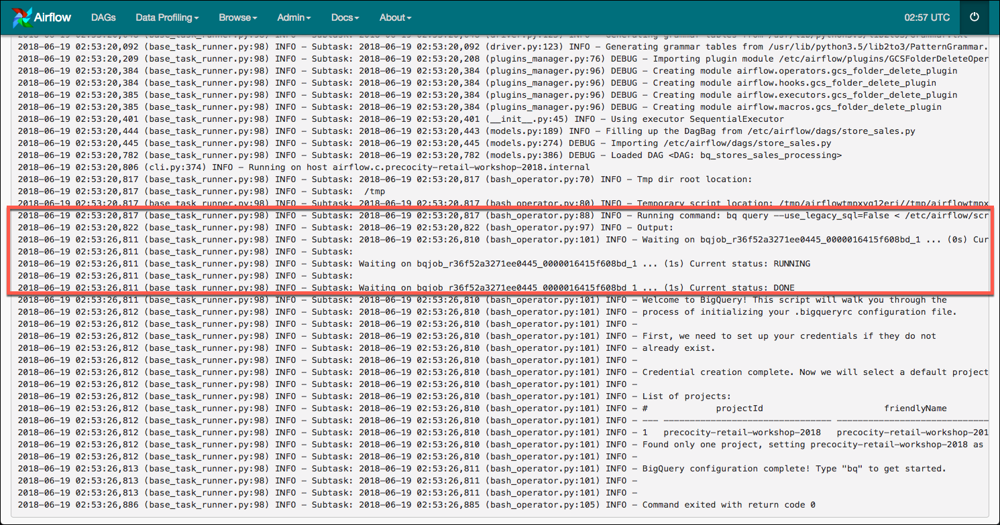

The log contents show the `bq query` command running, with a job id and at the bottom, some BigQuery initialization that occurs since it's been run on this instance for the first time.

Navigate to the BigQuery page of your Google Cloud Console to verify.


>Click the Show queries for all users from the Query History page

The screenshot above shows 2 instances have already run during the creation of this lab. The first kicked off immediately after un-pausing the DAG, the second once the next 10 minute interval was reached.

Remember the airflow service account that was created earlier as part of the Terraform configuration? This same service account is used by Airflow to communicate with BigQuery.

**Step 4:**
Modifying the bq_store_sales_processing DAG to use the BigQueryOperator

In this last part of the lab, you're going to finish configuring a Google Cloud Platform connection and modify the existing DAG to use the BigQueryOperator.

Before getting started, click the `Code` menu item from the Airflow logs page and scroll down to the bottom.

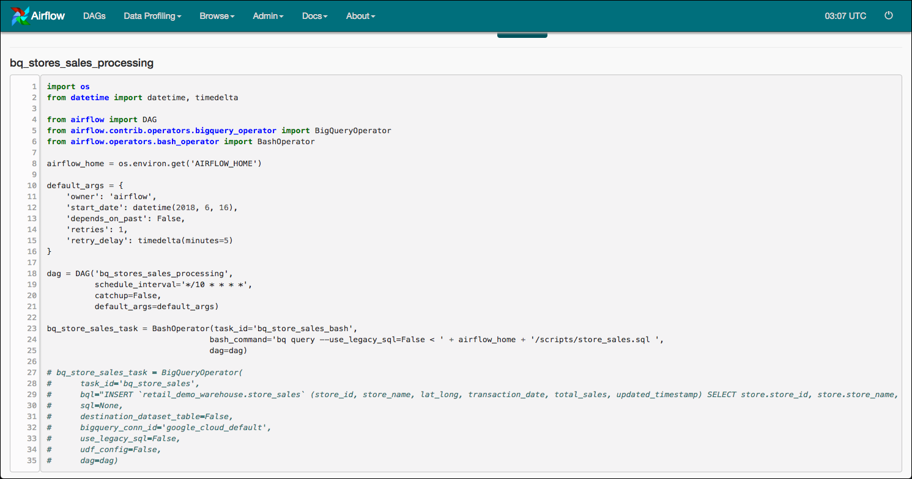

Lines 23-25 currently run the BashOperator task that you've seen in action. Lines 27-35 perform the same functionality, but using the BigQueryOperator. That's actually not totally accurate, the BigQueryOperator has additional functionality to write out the results to a destination dataset table, plus a number of other things not covered in this lab.

Before you edit this DAG, first finish configuring the Google Cloud Platform connection.

Click the `Admin | Connections` menu item.

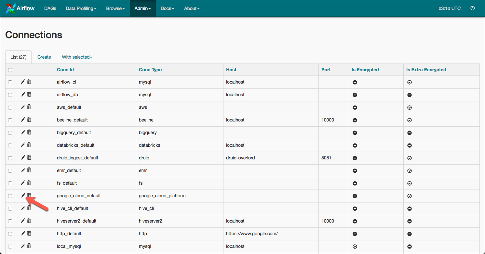

Click the pencil/Edit icon on the `google_cloud_default` connection.

Fill in the following data in the fields below:

*Project Id: This should be your Google Cloud Platform Project Id. It will be the same as your $GOOGLE_CLOUD_PROJECT environment variable.
*Keyfile Path: /etc/airflow/gce-airflow-key.json
*Scopes: https://www.googleapis.com/auth/cloud-platform

When complete, your screen should look similar to this:

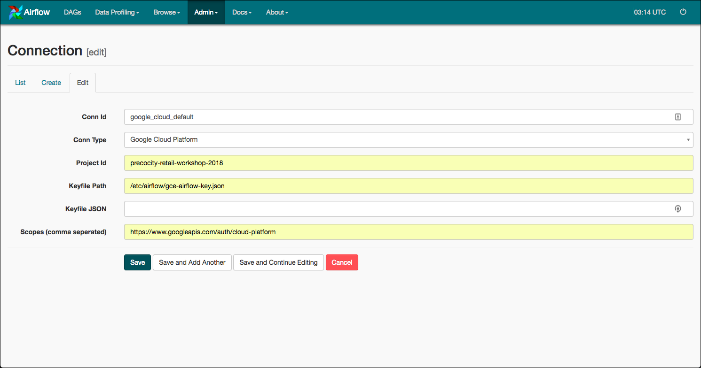

Click the Save button at the bottom.

Now, it's time to edit the DAG. Before making any changes to the code, go to the DAGs page and pause the `bq-stores-sales-processing` DAG. We don't want it running while editing it.

From your Google Cloud Console, navigate to the Compute Engine | VM instances page and click the `SSH` link on the "airflow" instance. When the SSH window appears, type the following commands:

```
sudo su airflow
cd /etc/airflow/dags
vi store_sales.py
```

Scroll down to line 23 and press `i` to enter INSERT mode for the vi editor. In the first character of lines 23-26 enter the `#` symbol.

>The color of the lines should turn to blue.

Use your arrow keys to move down to the first character of line 27. For lines 27-35, press the Del key to remove the `#` that appears with each line. Your editor screen should look as follows:

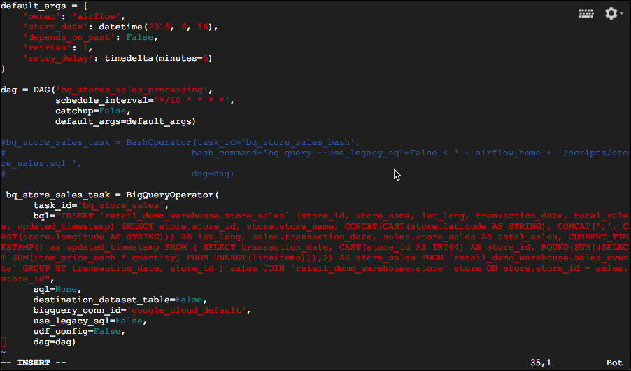

To save your changes, press the `ESC` key followed by `:wq` and Enter.

When you are returned to the shell prompt, go back to your Airflow page and click the `bq_stores_sales_processing` DAG and then the `Code` page from there.

>If you get an Ooops error, click the browser refresh button.

You should see lines 23-25 are commented out while lines 27-36 are ready to go.

Navigate to the DAGs page and un-pause the DAG you just edited.

>When you navigate to the page, if you see Broken DAG error like: Broken DAG: [/etc/airflow/dags/store_sales.py] unexpected indent (store_sales.py, line 27) this means that something went wrong when you edited the DAG. Go back to your shell and run `vi store_sales.py` again and correct the error.
>In the example given here, the `bq_store_sales_task` wasn't in the first column and Python is sensitive to indentation.

Once the DAG is un-paused it should run almost immediately. As before, you can click the green running icon or wait until it completes and click the success icon.

Navigate to the View Log page as you have done previously.

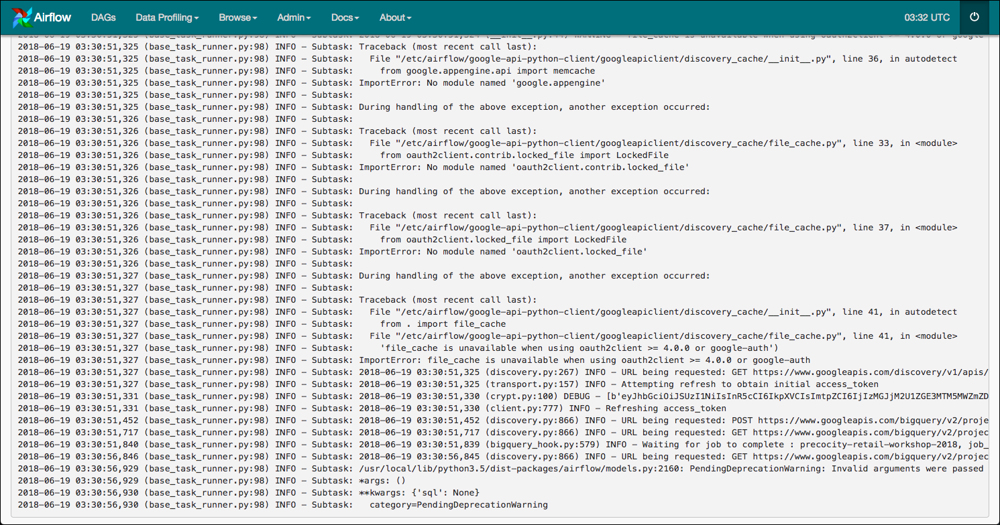

>The log outupt is considerably different when using the BigQueryOperator vs. the BashOperator. A number of additional INFO messages appear that are specific to that operator.

Navigate to your BigQuery | Query History page to see the most recent run. The same BigQuery code is executed as before. The difference between the operators is the additional functionality built into the BigQueryOperator that would require additional scripting when using the BashOperator.

Thank you for your time today. Hopefully you see the value in automating DataFlow and BigQuery tasks using Airflow.


