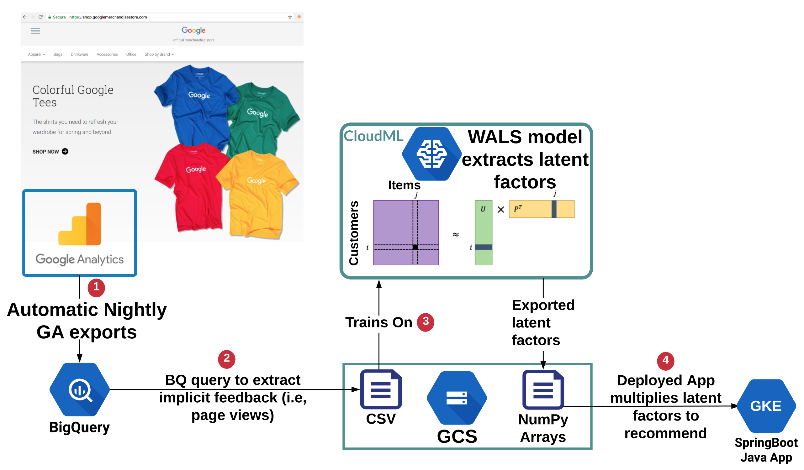
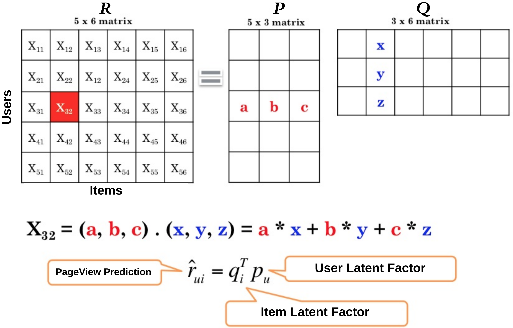

# Recommendations on GCP with TensorFlow and WALS

This README documents the process to build an end-to-end ecommerce recommender without spinning up any infrastructure, a completely managed solution using BigQuery & Cloud MLE.  The ingestion and training aspects of the build are documented in this README while the associated prediction service development & deployment is documented in the `recommender_svc/java` README


## High Level Architecture


 **GA360-BQ Export**: [Google's Own Merchandise Store](https://shop.googlemerchandisestore.com/) has been instrumented with Google Analytics 360 (GA360) like many ecommerce sites and GA360 automatically provides a nightly export to BigQuery of the raw, hit-level granularity data that is not available in just Google Analytcs. 

 **Ingest Implicit Feedback**: The BQ schema for GA360 is robust with complex nested structures, but we issue a fairly simple query to extract the imlicit feedback as a CSV that will form the training data for our recommender.  

 **Model Training**: From Cloud Shell, we issue a single command that packages & zips our Python/Tensorflow trainer and starts it as a job on Cloud ML.  This job in turn consumes the implicit feedback CSV stored in GCS, uses Weighted Alternating Least Squares (WALS) model to compute the latent factors and store them back in GCS.

 **Prediction Service**: A SpringBoog Java application was developed to implement the prediction service that uses the derived latent factores to generate recommendations for a given user.  This process is documented in the README in `recommender_svc/java`

## Prerequisites

* Cloud Shell
* `git clone https://github.com/precocity/gcp-retail-workshop-2018.git`
* `cd gcp-retail-workshop-2018/recommender`

##  Extract Data from BigQuery


1. **Prepare DataSet/Bucket:** Create a GCS bucket `$BUCKET` & BQ datset `GA360_MerchStore` to store the implicit feedback we build from BQ: 

	```sh
	BUCKET=gs://recommender_$GOOGLE_CLOUD_PROJECT
	gsutil mb ${BUCKET}
	bq mk GA360_MerchStore
	cd gcp-retail-workshop-2018/recommender
	```

2. **Implicit Feedback Query:** The following query will generate the the # of `page_views` for each `client_id`,`item_id` combo.  It selects from all 366 (1 year = 2016-08-01 - 2016-08-01) daily partitioned public BQ tables = `bigquery-public-data.google_analytics_sample.ga_sessions`.  

	```sql
	SELECT
	    fullVisitorId AS client_id,
	    hits.product.productSku AS item_id,
	    SUM(IF(hits.eCommerceAction.action_type=='6' AND hits.product.isImpression IS NULL, 1, 0)) AS page_views
	FROM
	    TABLE_DATE_RANGE(
	        [bigquery-public-data.google_analytics_sample.ga_sessions_],
	        TIMESTAMP('2016-08-01'),
	        TIMESTAMP('2017-08-01'))
	GROUP BY client_id, item_id
	HAVING 
	  client_id IS NOT NULL and page_views > 0
	```
	This query is contained in the `implicit_feedback_query.sql` file so you don't have type it in and can instead just issue it using the following bq command:
					
		bq query --replace=true --destination_table=GA360_MerchStore.implicit_feedback "`cat implicit_feedback_query.sql`"

3. **Extraction**: Extract newly created table into CSV into GCS BUCKET

	```sh
	TRAIN_FILE=$BUCKET/data/recommendation_events.csv
	bq extract GA360_MerchStore.implicit_feedback $TRAIN_FILE
	```	
		
##  Train Recommender using Cloud ML Engine
Now that the training file has been prepared and stored in GCS, we're ready to train our recommender.  The recommender is located `wals_ml_engine` directory. It takes 5-10 mins to train so let's fire it off first and then we'll walkthrough the details while it runs.


1. **ENV Setup**: Setup some ENV variables & change directory

	```sh
	JOBNAME=wals_$(date -u +%y%m%d_%H%M%S)
	ARGS="--data-type web_views --train-files ${TRAIN_FILE} --verbose-logging $@"
	cd wals_ml_engine
	```
2. **Train the Model**: Execute Cloud MLE command:

	```sh
	gcloud ml-engine jobs submit training ${JOBNAME} \
	 --region us-east1 \
	 --scale-tier=CUSTOM \
	 --job-dir=$BUCKET \
	 --module-name trainer.task \
	 --package-path trainer \
	 --config trainer/config/config_train.json \
	 -- \
	 ${ARGS}
	```
3.  **Stream the Logs** (optional) : If you want to see the progress by monitoring the StackDriver logs, issue the following command

	```sh
	gcloud ml-engine jobs stream-logs $JOBNAME
	``` 


# WALS Example

While MLE is training the model, let's discuss it a bit more in-depth.  The built in WALS model in Tensorflow is a collaborative filtering algorithm that performs matrix factorization via an alternating least squares method.  Let's break that down.  The implicit feedback we generated in `$TRAIN_FILE` forms a spare matrix of Items/Users, similar to *R* matrix below where the *X<sub>ui</sub>* entry is the # of items user *u* has viewed the detail page of item *i*.   The iterations of the WALS training process derive the latent factors *P* & *Q* by *alternating* between fixing *P* & computing *Q* and fixing *Q* and computing *P*.
	
Note, that R is very sparse and most of the *X<sub>ui</sub>* are missing and obviously WALS only trains on the observed/populated entries.   In the example below, suppose user 3 had NOT viewed item 2 and hence red entry *X<sub>32</sub>* is missing.  The predicted value for it can computed by doing the cross product of the dervied latent factors *P* & *Q*.  


# Cloud MLE Submission

As graphically depicted below, the cloud MLE command prepares a python trainer package using the model, task, & other .py files in the trainer directory.  It then zips it up and starts it on Cloud MLE.  The output of the training are the latent factors stored in `$BUCKET`


		 
		 
			

